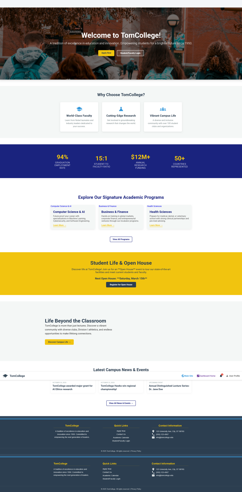
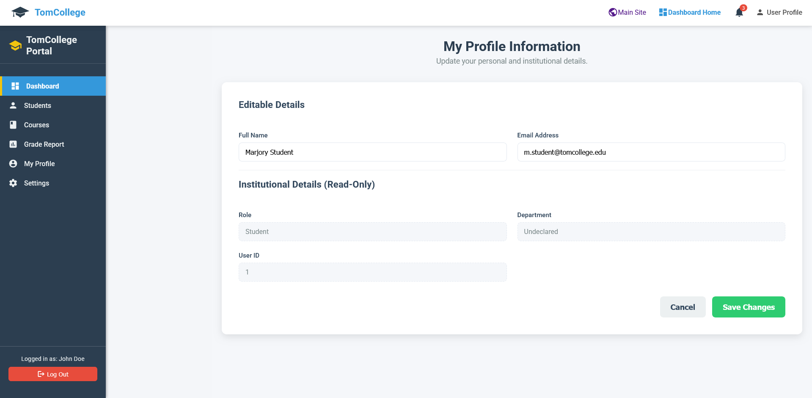
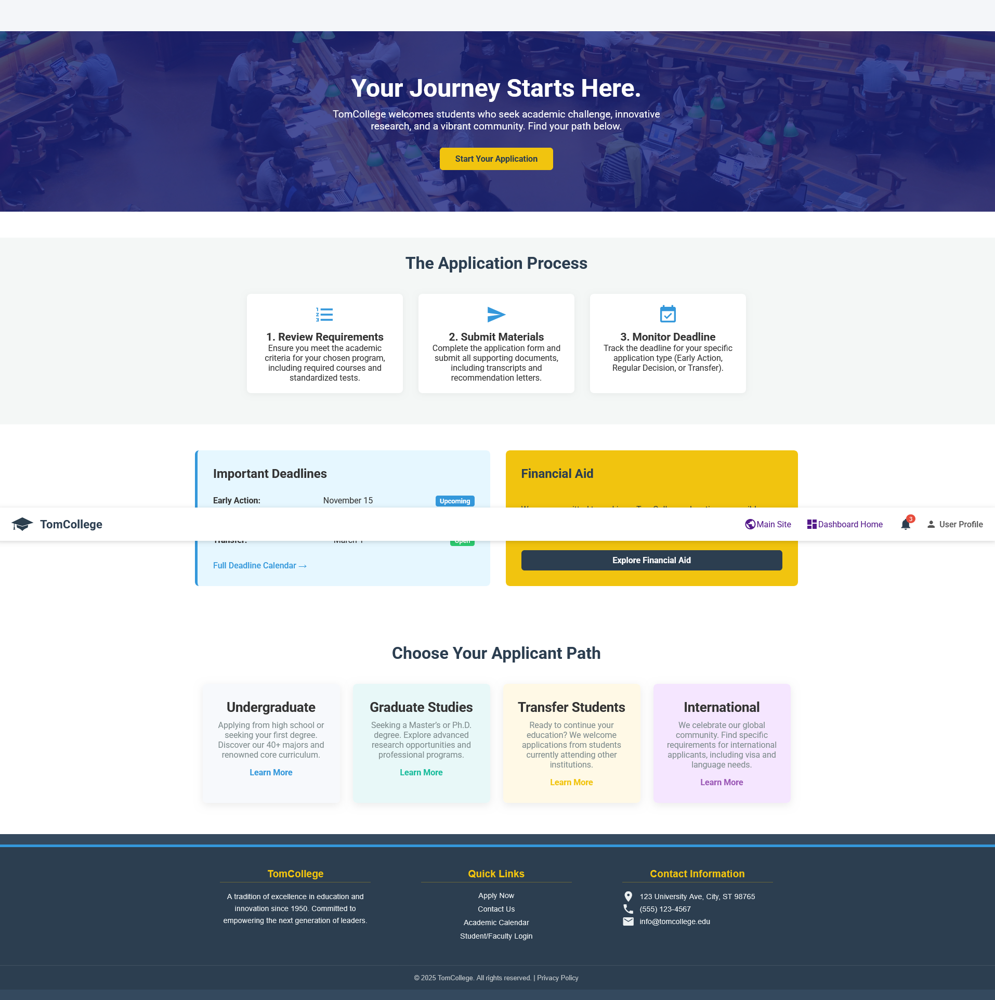
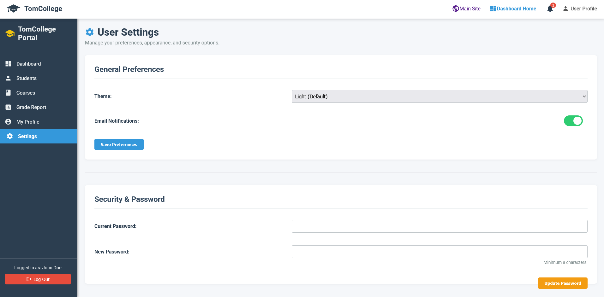

# 🎓 TomCollege Portal & Dashboard

A comprehensive **web-based college portal** and administrative dashboard for managing students, courses, and academic data using a modern Angular standalone architecture.

---

### 🧑‍💻 Author
**Marjory D. Marquez**

### 🏷️ Project Information
- **Project Name:** TomCollege 
- **Version:** 1.0.0 (Standalone Architecture) 
- **License:** MIT 

---

## 📋 Table of Contents
- [Overview](#-overview)
- [Features Implemented](#-features-implemented)
- [Technologies Used](#-technologies-used)
- [Project Structure](#-project-structure)
- [Screenshots](#-Screenshots)
- [Installation and Usage](#-installation-and-usage)
- [API Documentation](#-api-documentation)
- [Case Study](#-case-study)

---

## 🎓 Overview

**TomCollege** is a full-stack proof-of-concept application simulating a modern college website and its secure administrative dashboard. The system showcases a clear separation between public-facing informational pages and a private, data-driven management dashboard, secured by mock authentication.

### 🧾 Description
The primary goal of this project is to demonstrate **modern Angular standalone component architecture**, strong **component reusability**, and **conditional layout rendering** based on route state (public vs. secure dashboard). It utilizes a simple **Node/Express mock backend** to simulate real API data fetching for metrics, tables, and student information.

### 🔑 Key Highlights
- 🏛️ **Dual Architecture:** Public-facing website (`/`, `/admissions`) and Secure Dashboard (`/dashboard`).
- 🔄 **Conditional Layout:** Dynamic rendering of the sidebar and navbar only on secure dashboard routes.
- 🧱 **Angular Standalone:** Built entirely using Angular Standalone Components, Modules are not required.
- 🔌 **Mock API Integration:** Uses a lightweight Express server to simulate data retrieval from API endpoints.
- 🛡️ **Route Protection:** Implements a simple `AuthGuard` to protect all dashboard links.

---

## ✨ Features Implemented

### 🌐 Public Website (Unprotected)
- **Home Page (`/`):** Landing page with institutional information and navigation to key areas.
- **Admissions Page (`/admissions`):** Informational page placeholder.
- **Faculty Directory (`/faculty`):** Informational page placeholder.
- **Login Page (`/login`):** Component to access the secure area.

### 📊 Secure Dashboard (Protected via Login)
- **Dashboard Overview (`/dashboard`):** Displays key metrics (cards) and recent activity (tables).
- **Student Management (`/dashboard/students`):** Placeholder for CRUD operations on student data.
- **Course Catalog (`/dashboard/courses`):** Placeholder for viewing available courses.
- **Grade Report (`/dashboard/grades`):** Displays user's current GPA and a table of course grades.
- **User Profile (`/dashboard/profile`):** Allows viewing and mock-updating of user details.

---

## 🛠️ Technologies Used

### 🖥️ Frontend
| Technology | Purpose |
|-------------|----------|
| **Angular (v17+)** | Frontend framework using Standalone Components |
| **TypeScript** | Programming language |
| **Angular Router** | Conditional routing and layout management |
| **RxJS** | Reactive programming for data streams |
| **Material Icons** | Consistent icon set for UI |

### ⚙️ Backend & Data
| Technology | Purpose |
|-------------|----------|
| **Node.js** | Runtime environment for the API |
| **Express.js** | Minimalist web framework for creating mock REST API |
| **CORS** | Middleware to allow cross-origin requests from Angular frontend |
| **Dotenv** | Manages environment variables for port and API origin |
| **Mock Data (`MockData.js`)** | JavaScript file serving as the temporary data source |

---

## 📁 Project Structure

The project uses a combined monorepo-style structure, with the Angular application in the root and the Express server in a dedicated `backend` folder.


```
TomCollege-Project-Root/
├── backend/                      (The backend server directory)
│   ├── src/                      (Source code for the server, e.g., Express/Django)
│   │   ├── config/               (Database connections, environment setup)
│   │   ├── controllers/          (Logic for handling HTTP requests)
│   │   ├── models/               (Database schemas, e.g., Mongoose models, SQL definitions)
│   │   ├── routes/               (API endpoints, e.g., user.routes.js)
│   │   └── server.js / app.py    (Main application entry file)
│   ├── node_modules/             (Backend dependencies)
│   ├── package.json              (Backend dependencies and scripts)
│   └── .env                      (Environment variables)
│
├── tomcollege-app/               (The Angular Frontend directory - current focus)
│   ├── node_modules/             (Frontend dependencies)
│   ├── src/
│   │   ├── app/                  (Application root)
│   │   │   ├── core/             (App-wide services, models, guards)
│   │   │   │   ├── guards/
│   │   │   │   │   └── auth.guard.ts
│   │   │   │   ├── models/
│   │   │   │   │   └── faculty.model.ts  (FacultyMember Interface)
│   │   │   │   ├── services/
│   │   │   │   │   └── faculty.service.ts (Mock Data/API access)
│   │   │   │   └── core.module.ts
│   │   │   │
│   │   │   ├── features/         (Auth and Dashboard components/modules)
│   │   │   │   ├── dashboard/
│   │   │   │   │   ├── dashboard.component.ts (Dashboard Layout/Shell)
│   │   │   │   │   ├── students/
│   │   │   │   │   │   └── students.component.ts
│   │   │   │   │   └── courses/
│   │   │   │   │       └── courses.component.ts
│   │   │   │   └── login/
│   │   │   │       └── login.component.ts (Feature Component)
│   │   │   │
│   │   │   ├── public/           (Publicly accessible pages)
│   │   │   │   ├── admissions/
│   │   │   │   │   └── admissions.component.ts (Next component to build)
│   │   │   │   ├── faculty/
│   │   │   │   │   └── faculty.component.ts (The component we just fixed)
│   │   │   │   └── home/
│   │   │   │       └── home.component.ts
│   │   │   │
│   │   │   ├── app.routes.ts     (Routing configuration)
│   │   │   └── app.component.ts  (Root component)
│   │   │
│   │   └── assets/
│   │   └── styles.css
│   │
│   ├── .gitignore
│   ├── angular.json
│   ├── package.json
│   └── tsconfig.json             (TypeScript configuration)
│
└── README.md
```

---

## ⚙️ Installation and Usage

You must run both the backend and frontend simultaneously.

### 1. Installation

```bash
# Clone the repository
git clone [https://github.com/Marjory00/TomCollege.git](https://github.com/Marjory00/TomCollege.git)
cd TomCollege

# Install all dependencies (installs dependencies for Angular and Express)
npm install

2. Running the Application

Open two separate terminal windows in the root TomCollege/ directory.

Terminal 1 (Backend API):
Bash

cd backend
node server.js
# The mock API will run on http://localhost:3000

Terminal 2 (Angular Frontend):
Bash

# Start the Angular server
npm start
# OR
ng serve
# The frontend will run on http://localhost:4200

```
### 📚 API Documentation

The mock backend exposes the following REST endpoints using the data.json file:
Method	Endpoint	Description	Status
GET	/api/dashboard	Returns all dashboard metrics and activity.	Implemented
GET	/api/students	Returns the list of all students.	Implemented
GET	/api/courses	Returns the list of all courses.	Implemented
GET	/api/profile	Returns the mock user profile data.	Implemented
GET	/api/grades/report	Returns the user's detailed grade report.	Implemented
GET	/api/grades/gpa	Returns the current GPA score.	Implemented

### 📖 Case Study

The TomCollege Portal & Dashboard project successfully solves the challenge of distinguishing between public marketing content and secure user-specific data within a single-page application framework. By implementing a conditional layout in app.component.ts driven by the Angular Router, the application can switch between the simple, public view (for visitors) and the complex, sidebar/navbar-equipped dashboard view (for logged-in users) without needing separate root modules. This technique provides a clean, maintainable, and highly efficient solution for dual-purpose web portals, a critical pattern for real-world enterprise applications like school management systems.


---

## 🖼️ Screenshots

The following screenshots demonstrate the core features and dual architecture of the TomCollege application:

---

### 🏠 Home Page

Main Page 




---


### 🎓 Student Dashboard

Students Dashboard Page




---


### 📚 Courses Page

Courses Page


---


### 👨‍🏫 Admissions Page

Admissions Page




---


### 👨‍🏫 User-Profile

User Profile 


---


### 📚 Notificstions Dashboard Page

Notifications Icon


---


### 👨‍🏫 Settings Page

Settings Page




---


### 👨‍🏫 Students Management

Students Management Page


---


| Feature | Image |
| :--- | :--- |
| **Public Home Page** |  |
| **Login Screen** |  |
| **Dashboard Overview** |  |

---

🤝 Contributing

Contributions, issues, and feature requests are welcome! Feel free to check the issues page.

⚖️ License

Distributed under the MIT License. See LICENSE for more information.

✉️ Contact

Marjory D. Marquez - [Your Contact Information Here] Project Link: https://github.com/Marjory00/TomCollege

